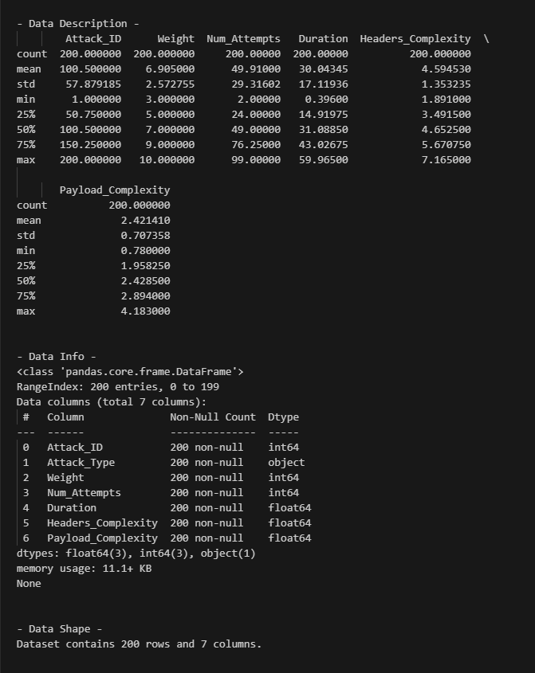
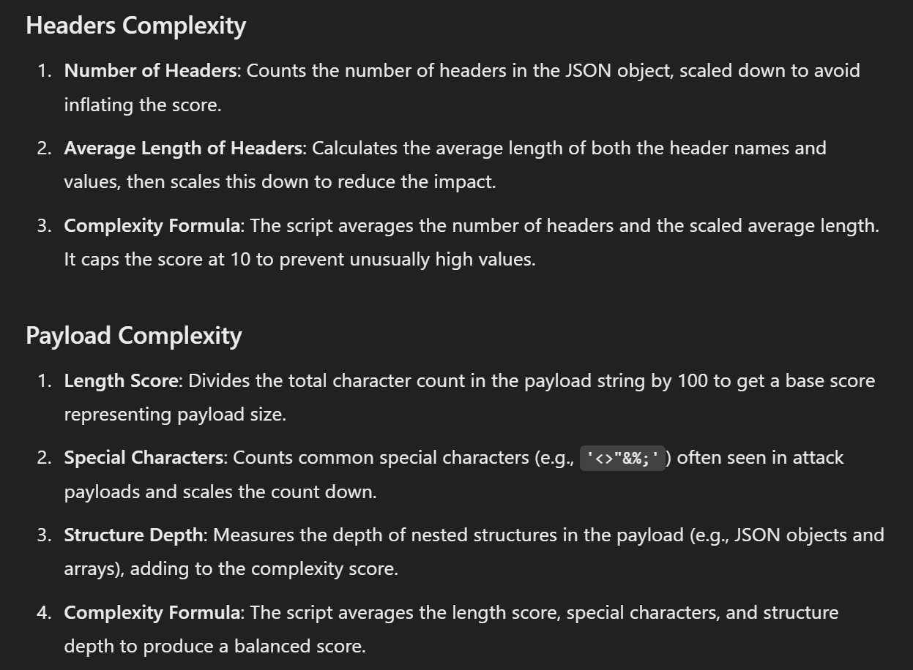
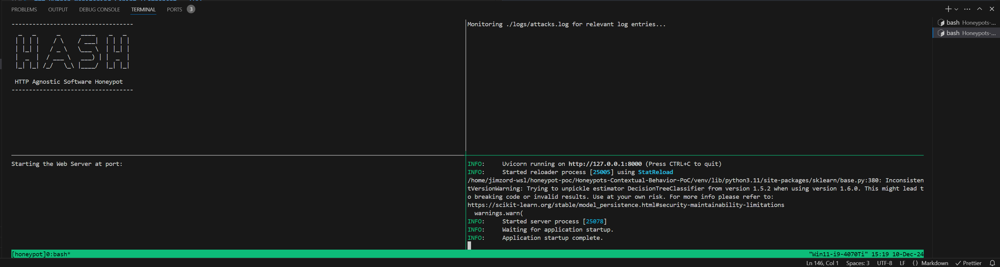

# About the Project

This is PoC about utilizing a honeypot to determine the skill level of the attacker. The main idea is to create another metric when using honeypots to record attackers actions and reseach their behaviors.

## Structure


1. **HASH Honeypot**: The honeypot logs the attackers actions into a file.
2. **Python Monitoring Script**: A script that moniotrs the log file and sends the data to the Go Server.
3. **Go Server**:
   - Receives the data from the monitoring script.
   - Processes the data.
   - Sends the data to the SQLite DB.
   - Sends the data to the FastAPI Python Server.
4. **FastAPI Python Server**:
   - Receives the data from the Go Server.
   - Futher process them.
   - Utilizes a simple ML Classification Model to determine the skill level of the attacker.
   - Updates the SQLite DB with the results.
5. **SQLite DB**: Stores the data about the attacks and the attackers skill levels.

# Required Software/Dependences

1. **Linux** (if you want to use the `start-project.sh` script)
   - tmux
2. **Python** (developed using 3.11)

   - FastAPI
   - Uvicorn
   - joblib
   - python-dotenv
   - scikit-learn
   - requests

3. **Node.js** (>= v20)
4. **Go (Golang)** (>= v1.21)

# Machine Learning Part

### Data Sheet

We synthesized a datasheet containing 200 attacks. Below you can the datasheet summary:


To calcualte the Headers and Payload Complexity, we used the following methodology:


### Processing the Data (Skill Score)

Next, we created a new feature called "Skill Score". It's purpose is to determine the skill level of the attacker.

1. First, we scaled each feature to make them comparable, we applied "min-max scaling".
2. Next, each feature’s scaled value is multiplied by a specific weight. These weights represent how important each feature is in calculating the skill score. This resulted in the following skill scores:
   
3. Finally, To make sure the final score is easy to interpret and lies within a range of 0 to 1, we normalize the calculated skill score again using min-max scaling. This ensures that a score of 1 represents the highest observed skill, and a score of 0 represents the lowest:
   

### Creating the Model

We used a simple **Decision Tree Classifier** to determine the skill level of the attacker. The model was trained on the proccessed datasheet.

Its task is to predict the skill level of the attacker based on the Skill Score feature calculated from the attack.

We manually set the thresholds for the skill levels.

| Skill Score   | Skill Level |
| ------------- | ----------- |
| 0.00 - 0.2499 | Low         |
| 0.25 - 0.4999 | Medium Low  |
| 0.50 - 0.7499 | Medium High |
| 0.75 - 1.0000 | High        |

Thus the classifacation of the attacker's skill level can be easily found. For this reason, the Model has shown an accuracy of 100%.

# Running the Project

## Setting Up the Environment

### Runtimes - Download/Install

**Operating System**: Linux or Windows' WSL 2

You must download and install the following **runtimes**:

1. **Node.js** (>= 20.XX)
2. **Go** (>= 1.21)
3. **Python** (>= 3.11)

I recommend to use AI Tools to help perform this action as it differs between OSes.

### Project Setup

1. Clone the repository

```bash
git clone https://github.com/<username>/<repo>
```

2. Run the automated script: `auto-sys-setup.sh`

```bash
./auto-sys-setup.sh
```

---

#### Python Setup

**Directory you should be in**: `/Honeypots-Contextual-Behavior-PoC` aka (Project root dir)

1. Create a Virtual Environment Create and activate a virtual environment:

```bash
python3 -m venv venv
source venv/bin/activate  # Linux/macOS
```

2. (If you did NOT used `auto-sys-setup.sh`) Install Dependencies Install Python dependencies from your `combined_requirements.txt`:

```bash
pip install -r combined_requirements.txt
```

3. (If you did NOT used `auto-sys-setup.sh`) Verify Python Setup Ensure all Python dependencies are installed:

```bash
python -m pip list
```

---

#### NodeJS Setup

**Directory you should be in**: `/Honeypots-Contextual-Behavior-PoC` aka (Project root dir)

1. (If you did NOT used `auto-sys-setup.sh`) Install the dependencies

```bash
npm install
```

---

#### Go Server Setup

1. (If you did NOT used `auto-sys-setup.sh`) **Navigate** to `Honeypots-Contextual-Behavior-PoC/apiserver`

```bash
go mod tidy
```

---

#### Python Server Setup

1. (If you did NOT used `auto-sys-setup.sh`) **Navigate** to `Honeypots-Contextual-Behavior-PoC` (the root dir)

```bash
python3.11 -m venv venv
source venv/bin/activate
pip install --upgrade pip
pip install -r combined-requirements.txt
```

## Spinning Up the Project

#### The Auto Way (requires `tmux`)

```bash
chmod +x start-project.sh
./start-project.sh
```

If it executes successfully, you should see something like this:



---

## Run the Components Manually

### HASH (Component - 1/4)

**Directory you should be in**: `/Honeypots-Contextual-Behavior-PoC` aka (Project root dir)

To run:

```bash
npx hash-honeypot run myhoneypot2 -l file -f ./logs/attacks.log
```

In the case that it complains that it can't find the folder `myhoneypot2`, you can create a new one by running:

```bash
npx hash-honeypot generate myhoneypot3
```

---

### Python Monitoring Script (Component - 2/4)

**Directory you should be in**: `/Honeypots-Contextual-Behavior-PoC` aka (Project root dir)

To run:

```bash
python myhoneypot2/monitor_hash_log.py
```

---

### Go Server (Component - 3/4)

**Directory you should be in**: `/Honeypots-Contextual-Behavior-PoC/apiserver` **NOT ROOT**

To run:

```bash
go run --tags json1 apiserver/cmd/api/main.go
```

---

### FastAPI Python Server (Component - 4/4)

**Directory you should be in**: `/Honeypots-Contextual-Behavior-PoC/fastapiserver` **NOT ROOT**

Go to Directory:

```bash
cd fastapiserver
```

To run:

```bash
python -m uvicorn main:app --reload
```

## How can this PoC be improved

1. Use real and more data.
2. Use K-means Clustering to determine how many skill levels should the attackers be classified into.
3. Train and use a more complex model to determine the skill level of the attacker.
